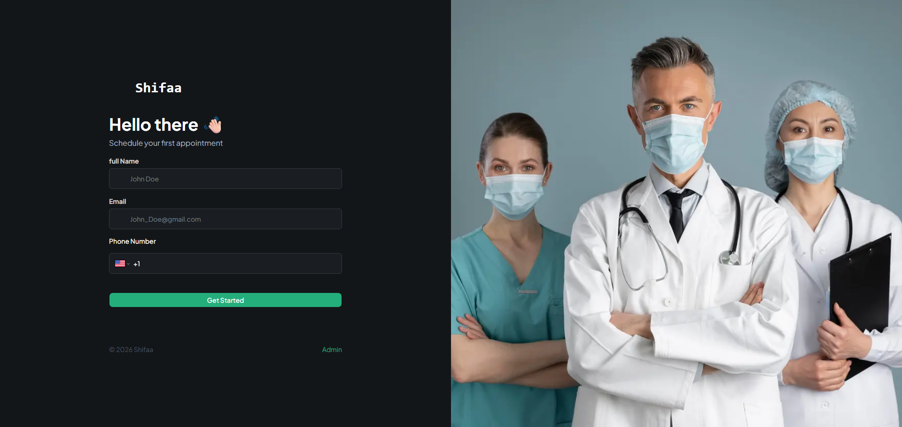
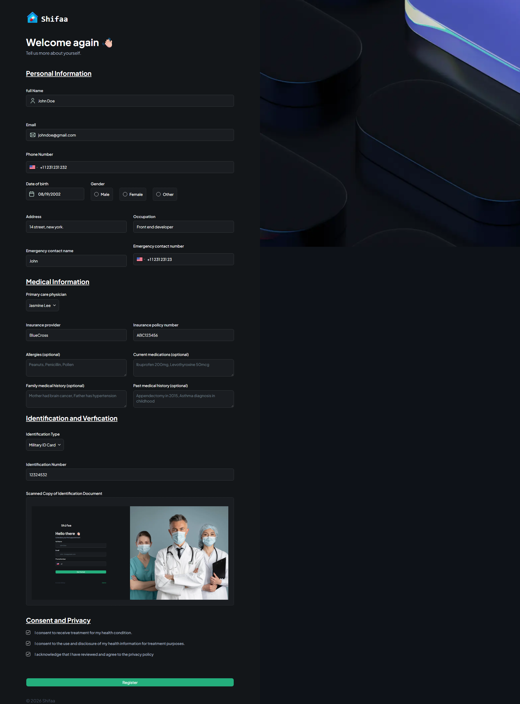
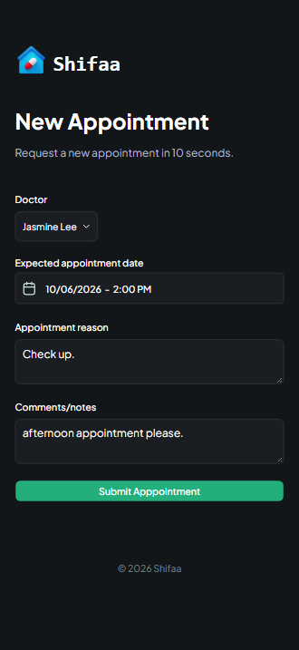
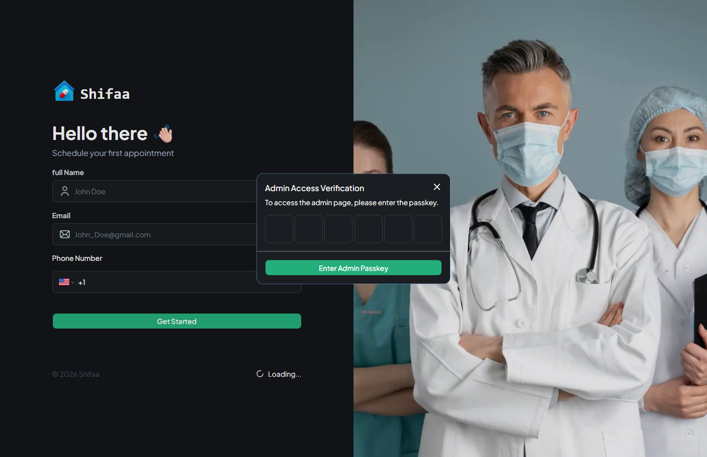
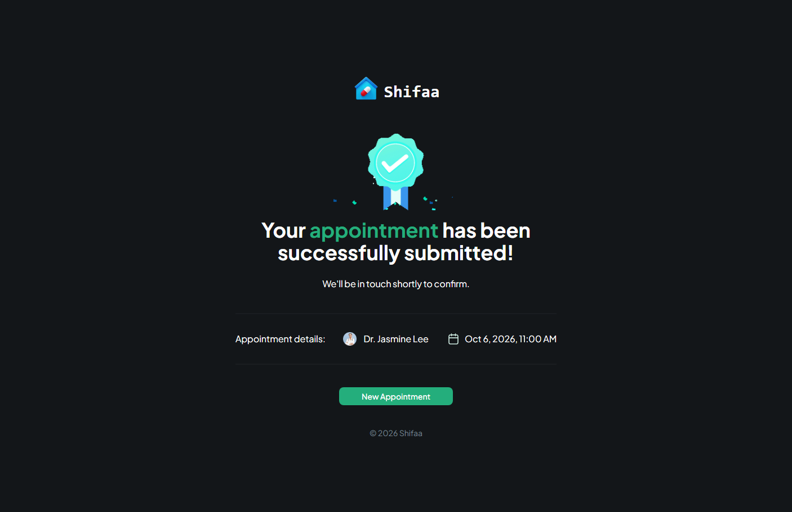
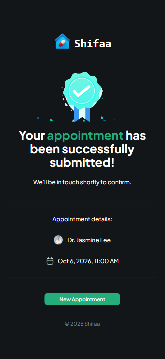
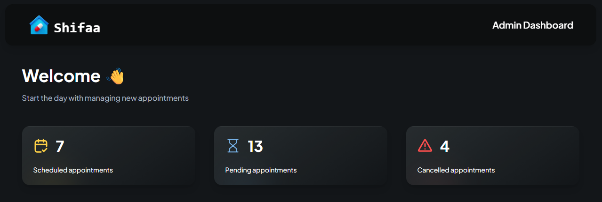
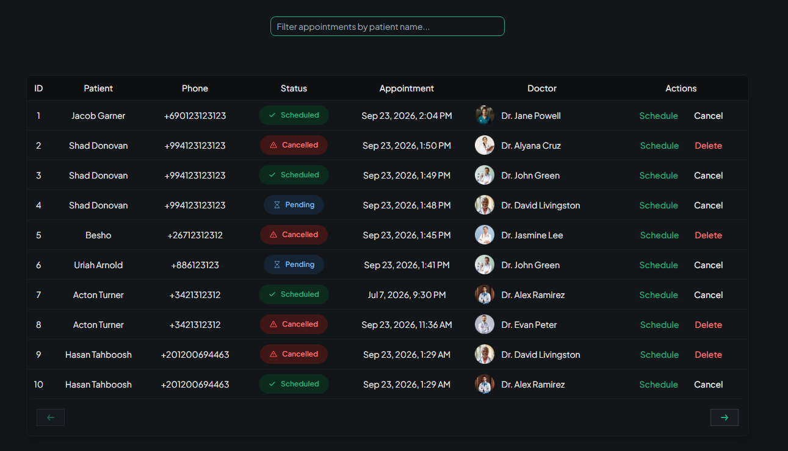
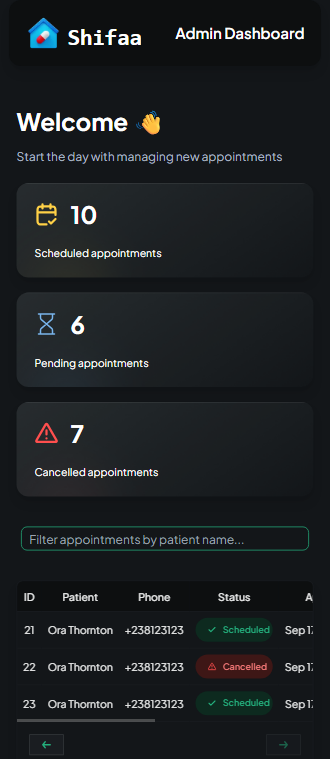

# 🏥 Shifaa - Modern Medical Healthcare Management System

Shifaa is an end-to-end medical appointment booking and administrative management platform built with Next.js App Router, Appwrite, and Shadcn UI. It enables patients to register, request appointments with primary care physicians, and allows clinic administrators to verify, schedule, or cancel appointments.

---

## 🌐 Live Demo & Preview

- **Live Demo:** [https://shifaa-pearl.vercel.app](https://shifaa-pearl.vercel.app/)

---

## ✨ Key Features

- **Patient Management:** Multi-step onboarding with profile validation and medical record handling.
- **Appointment Scheduling System:** Interactive booking form with doctor selection and schedule picking.
- **Passkey-Protected Admin Portal:** Secure administrative route with client-side passkey verification to prevent layout flickering.
- **Real-time Analytics Dashboard:** Summary cards tracking total, scheduled, pending, and cancelled medical appointments.
- **Interactive Data Table:** Advanced filtration, custom pagination, and responsive layout built with TanStack Table and Shadcn UI.

- **Persistent Admin Authentication:** Uses AES encryption from the crypto-js library to securely encrypt the admin passkey before storing it in localStorage. This allows returning admins to access the dashboard without re-entering their passkey on every visit.

- **Optimized UX & Performance:** Fully responsive layout with custom loading states and zero dynamic layout shifts.

---

## 🛠️ Tech Stack & Architecture

- **Framework:** Next.js (App Router, Server Components, Server Actions)
- **Language:** TypeScript
- **Backend & Database:** Appwrite Cloud (Databases, Tables, Authentication)
- **UI Components & Styling:** Tailwind CSS, Shadcn UI
- **Form Validation:** React Hook Form, Zod

## 📸 Application Screenshots & Key Workflows

---

### 1. Initial Patient Identification (Home Page)

> Clean entry page acting as a lightweight identification step. Collects basic patient details (Name, Email, Phone) to check existing records or initiate a new onboarding process.

  

**Key Features:**

- Smooth client-side validation using React Hook Form and Zod.
- Direct routing logic redirecting returning users or sending new patients to full onboarding.

---

### 2. Patient Onboarding & Registration

> Interactive multi-step form built with **React Hook Form** and **Zod** schema validation. Captures patient details, identification documents, and medical emergency history smoothly.

  

**Key Features:**

- File upload integration via Appwrite Storage.
- Dynamic input verification and clear client-side validation error messages.

---

### 3. Doctor Selection & Appointment Request

> Intuitive booking interface allowing registered patients to select their primary physician, schedule date and time, and specify medical reasons or allergies.

  

**Key Features:**

- Custom date-time picker and doctor selection components.
- Server-side action submitting structured payload directly to Appwrite Cloud DB.

---

### 4. Admin Authentication & Security

> Client-side passkey verification modal (`PasskeyModal`) ensuring authorized access to administrative routes without server-side layout flickering or hydration shifts.

  

**Key Features:**

- Custom 6-digit OTP Input slot layout using Shadcn UI.
- Responsive dialog layout optimized for mobile and desktop viewports.

---

### 5. Appointment Confirmation & Success Page

> Dedicated confirmation screen displayed immediately after a successful booking request. Features appointment details, selected doctor, schedule timestamp, and clear next steps for the patient.

  
  

**Key Features:**

- Dynamic route driven by appointment ID URL parameters.
- Informative UX notifying the patient to expect a confirmation call or email from the clinic receptionist.

---

### 6. Administrative Dashboard & Data Management

> Comprehensive control panel showing real-time appointment metrics (Total, Scheduled, Pending, Cancelled) and an interactive data table powered by **TanStack Table**.

  
  
  

**Key Features:**

- Dynamic relationship population (`Query.select`) to display patient and physician data seamlessly.
- Custom pagination controls, real-time revalidation, and status filtering.
