# 🏥 Shifaa - Modern Medical Healthcare Management System

Shifaa is an end-to-end medical appointment booking and administrative management platform built with Next.js App Router, Appwrite, and Shadcn UI. It enables patients to register, request appointments with primary care physicians, and allows clinic administrators to verify, schedule, or cancel appointments.

---

## 🌐 Live Demo & Preview

- **Live Demo:** [https://shifaa-pearl.vercel.app](https://shifaa-pearl.vercel.app/)
-
- **Passkey to access admin page:** [123456]

---

## ✨ Key Features

- **Patient Management & Onboarding:** Multi-step onboarding with profile validation, identification checking, tracking, and patient account status management.
- **Appointment Scheduling System:** Interactive booking flow with real-time doctor availability, schedule selection, and instant booking confirmation.
- **Server-Authenticated Admin Portal:** Production-level administrative route protection leveraging **Server Actions**, **HttpOnly Cookies**, and **Next.js Middleware** to eliminate layout flicker and prevent unauthorized access.
- **Real-time Analytics Dashboard:** Live metric cards tracking total, scheduled, pending, and cancelled medical appointments in real time.
- **Interactive Data Table:** Advanced status filtration, custom server/client pagination, and responsive layout built with **TanStack Table** and **Shadcn UI**.
- **Reactive UI State Transitions:** Automatic Navbar state shifts (Login/Register buttons vs. Patient Avatar Dropdown) synchronized globally via React Query query invalidations upon login or logout.
- **Optimized UX & Performance:** Fully responsive dark-themed UI (Slate/Blue/Emerald palette), custom loading skeletons, and zero cumulative layout shifts (CLS).

---

## 🛠️ Tech Stack & Architecture

- **Framework:** Next.js (App Router, Server Components, Server Actions)
- **Language:** TypeScript
- **State Management & Caching:** TanStack React Query (v5)
- **Backend & Database:** Appwrite Cloud (Databases, Tables, Authentication)
- **Authentication & Security:** HttpOnly Cookies, Next.js Middleware
- **UI Components & Styling:** Tailwind CSS, Shadcn UI, Lucide Icons
- **Form Handling & Validation:** React Hook Form, Zod
- **Notifications:** Toast Notifications

---

## 📐 Technical Architecture & Trade-offs

During development, several key architectural challenges were solved to optimize performance, real-time consistency, and user experience:

- **Global Cached State & Cache Invalidation:** Standardized on TanStack React Query with centralized query keys (`["patient", "me"]`) to deliver instant local access to patient data. Integrated automatic `queryClient.invalidateQueries` and `router.refresh()` sequence upon authentication mutations to enforce immediate, seamless UI updates without full page reloads.
- **Server-Side Authentication via HttpOnly Cookies:** Abandoned client-side session dependence (`account.get()`) in favor of storing the patient `userId` inside encrypted `HttpOnly` cookies (`patient-user-id`). This architecture allows Server Components and Server Actions to query patient records directly with elevated server privileges (`authenticated_admin_session`) while mitigating XSS threats.
- **Appwrite Relational Data Population:** Resolved Appwrite SDK relational fetching limits by implementing explicit `Query.select(["*", "patient.*"])` pipelines to fetch populated nested patient and doctor objects without executing secondary network round-trips.
- **Bulk Update Limitations on Relationships:** Workaround for Appwrite's constraint on bulk row updates (`updateRows`) over relationship schemas by refactoring mutation handlers to use concurrent single-row updates (`updateRow`).
- **Dynamic Page Caching & Real-time Revalidation:** Forced dynamic route evaluation alongside React Query background revalidation (`refetchInterval` / `refetchOnWindowFocus`) to bypass Next.js App Router static caching and guarantee real-time synchronization between Admin and Patient portals.

---

## 🔒 Security & Data Integrity

- **HttpOnly Cookie Isolation:** Sensitive user session markers and server API keys (`authenticated_admin_session`) are restricted exclusively to server execution contexts, preventing credential leakage to client bundles.
- **Route Guard Middleware:** Next.js Middleware acts as the primary barrier, intercepting unauthorized attempts to access protected routes and redirecting with context-aware URL query parameters.
- **Strict Payload Validation:** Comprehensive Zod schemas applied across login, registration, contact, and scheduling forms to enforce sanitization of emergency contacts, phone formats, and medical details before API transmission.

---

## 📸 Application Screenshots & Key Workflows

---

### 1. Interactive Homepage (/)

The primary entry point featuring hero sections, value propositions, key statistics, quick appointment call-to-actions, and dynamic showcase components.

  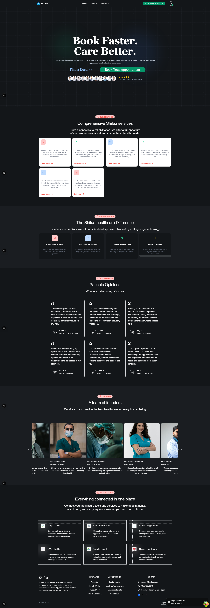

**Key Features:**

- High-converting Hero Section with direct routing to booking flows.
- Real-time medical specialties grid and quick platform statistics.
- Direct status check for returning patients.

---

### 2. Medical Team & Specialists Directory (/doctors)

> Comprehensive directory listing all verified healthcare providers with filtering by specialty, availability, and rating.

  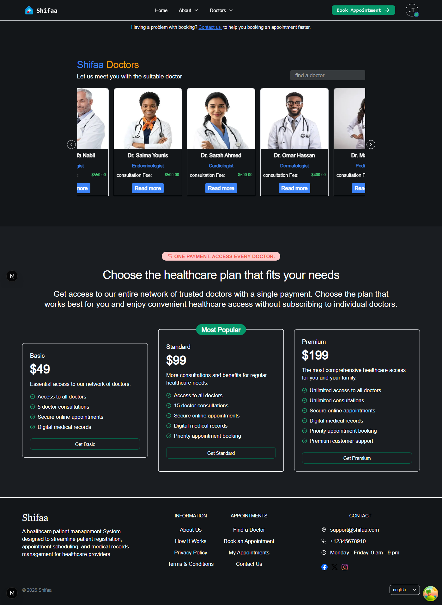

**Key Features:**

- Dynamic search and filter by a doctor name.
- Direct accessibility badges (Real-time availability status).
- Quick booking triggers linking straight to the physician's schedule.

---

### 3. Physician Detailed Profile (/doctors/[doctorId])

> Specialized doctor page detailing qualifications, educations, experience, available today, and rate.

  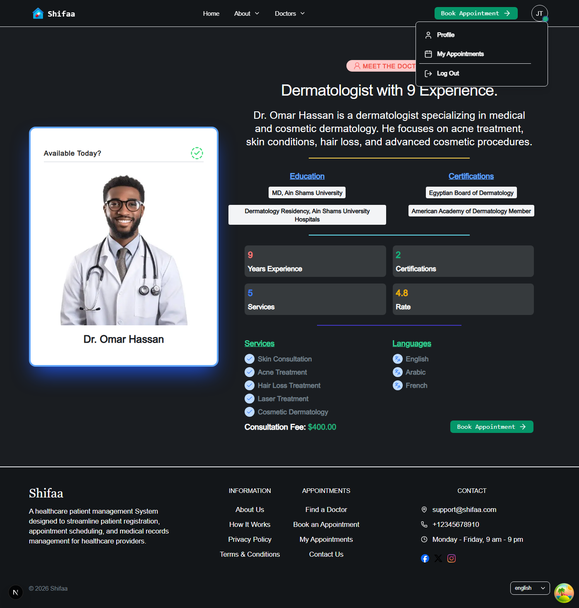

**Key Features:**

- Integrated schedule picker for selecting appointment slots.
- Biography, certifications, and accepted health insurance providers.
- Direct embedded booking modal.

---

### 4. Initial Patient Identification (Login Page)

> Clean login page acting as a lightweight identification step. Collects basic patient details (Email & Password) to check existing records or initiate a new onboarding process (Create Account).

  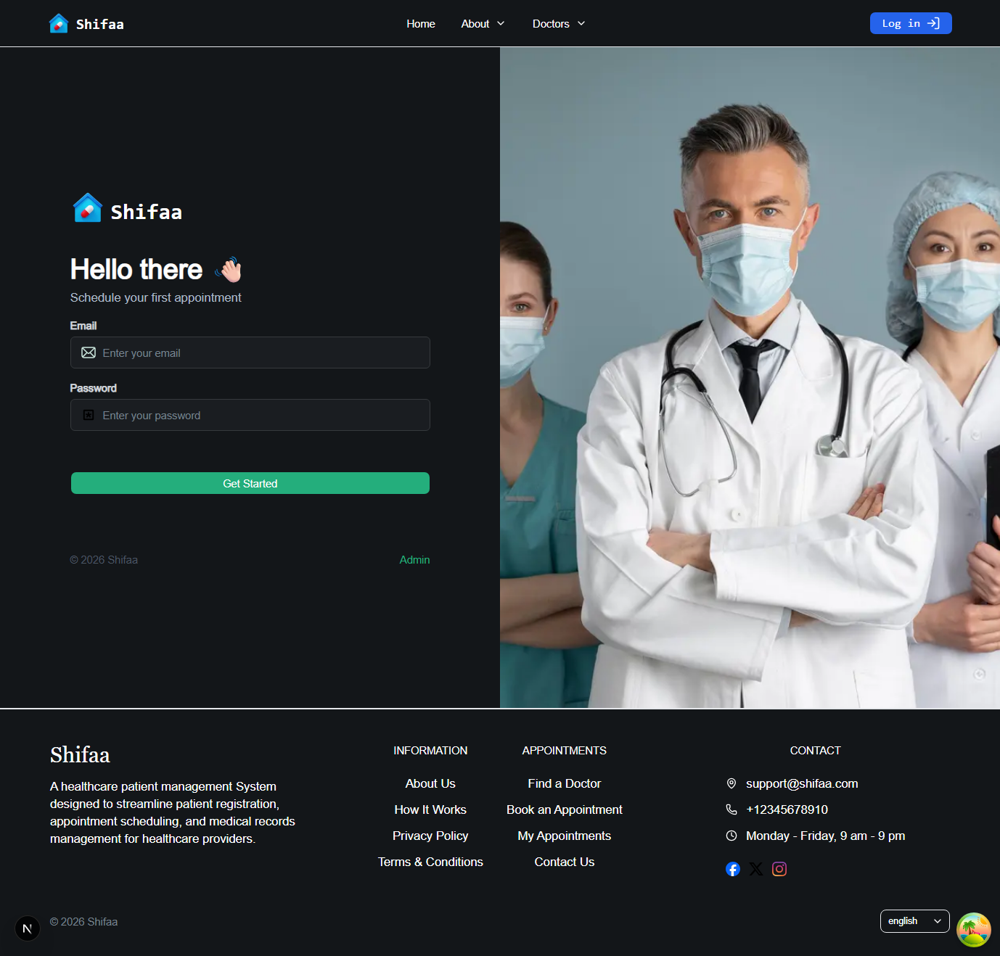

**Key Features:**

- Smooth client-side validation using React Hook Form and Zod.
- Direct routing logic redirecting returning users or sending new patients to full onboarding.

---

### 5. Patient Onboarding & Registration

> Interactive multi-step form built with **React Hook Form** and **Zod** schema validation. Captures patient details and identification documents.

  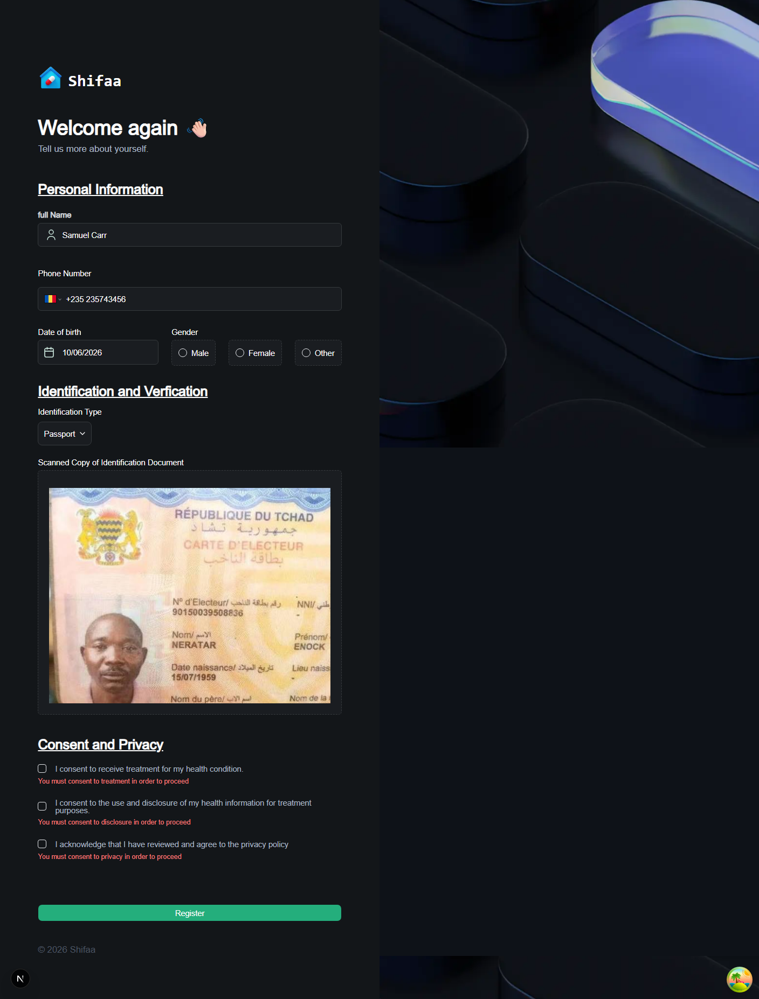

**Key Features:**

- File upload integration via Appwrite Storage.
- Dynamic input verification and clear client-side validation error messages.

---

### 6. Doctor Selection & Appointment Request (/new-appointment)

> Intuitive booking interface allowing registered patients to select their primary physician, schedule date and time, and specify medical reasons or comments/notes.

  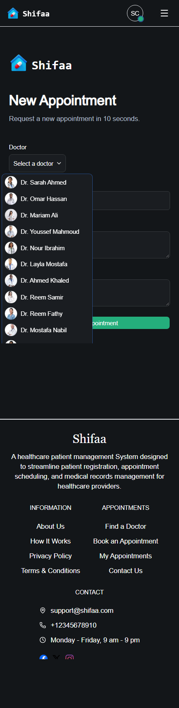

**Key Features:**

- Custom date-time picker and doctor selection components.
- Server-side action submitting structured payload directly to Appwrite Cloud DB.

---

### 7. Admin Authentication & Security

> Client-side passkey verification modal (`PasskeyModal`) ensuring authorized access to administrative routes without server-side layout flickering or hydration shifts.

  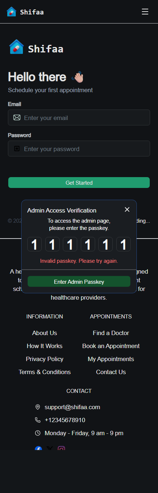

**Key Features:**

- Custom 6-digit OTP Input slot layout using Shadcn UI.
- Responsive dialog layout optimized for mobile and desktop viewports.

---

### 8. Appointment Confirmation & Success Page (/success)

> Dedicated confirmation screen displayed immediately after a successful booking request. Features appointment details, selected doctor, schedule timestamp, and clear next steps for the patient.

  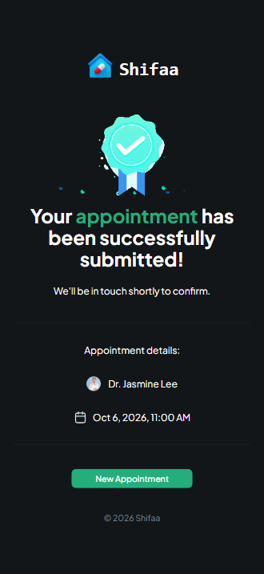

**Key Features:**

- Dynamic route driven by appointment ID URL parameters.
- Informative UX notifying the patient to expect a confirmation call or email from the clinic receptionist.

---

### 9. Administrative Dashboard & Data Management (/admin)

> Comprehensive control panel showing real-time appointment metrics (Total, Scheduled, Pending, Cancelled) and an interactive data table powered by **TanStack Table**.

  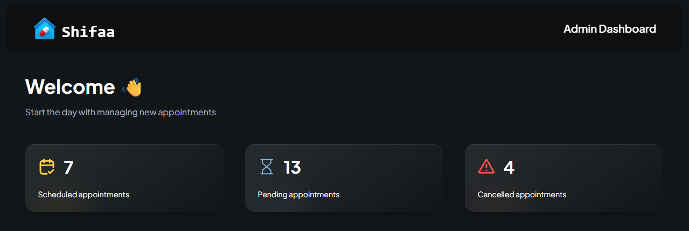
  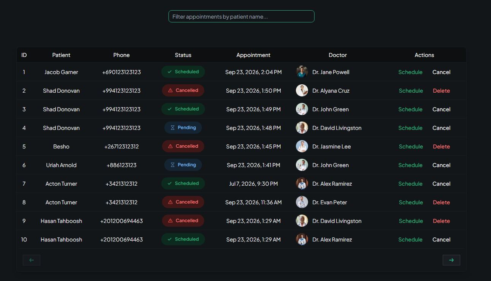
  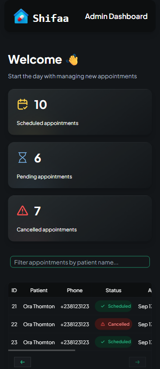

**Key Features:**

- Dynamic relationship population (`Query.select`) to display patient and physician data seamlessly.
- Custom pagination controls, real-time revalidation, and status filtering.

---

### 10. Patient Inquiry & Support Form (/contact)

> Secure communication portal with role-aware form behavior based on patient authentication status.

  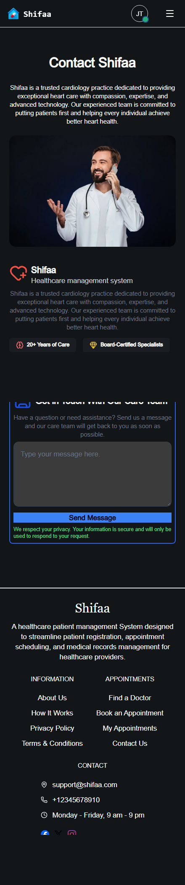

**Key Features:**

- Pre-fills patient data automatically when authenticated.
- Interactive message dispatch with toast feedback notifications.
- Emergency contacts and clinic map integration.

---

### 11. Platform Overview & Mission (/about)

> Brand story page outlining Shifaa's medical vision, core values, technology stack, and healthcare impact.

  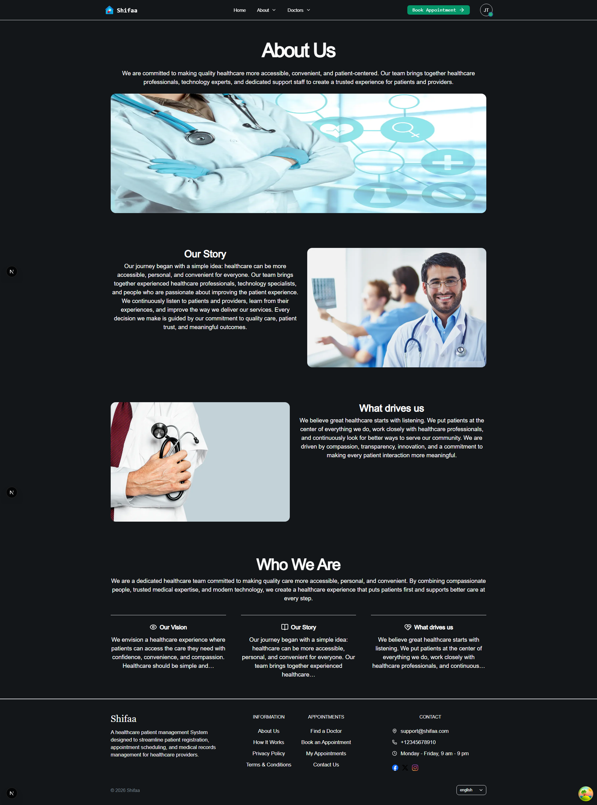

**Key Features:**

- Interactive timeline showing platform growth and achievements.
- Core pillars cards (Security, Speed, Accessibility, Care Quality).
- Leadership and medical advisory board showcase.

---
